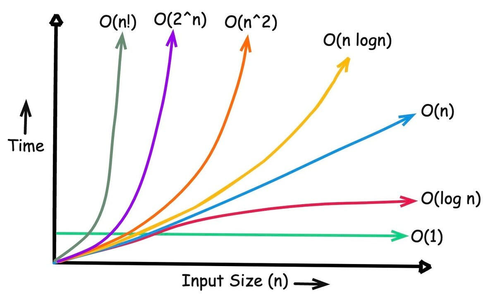
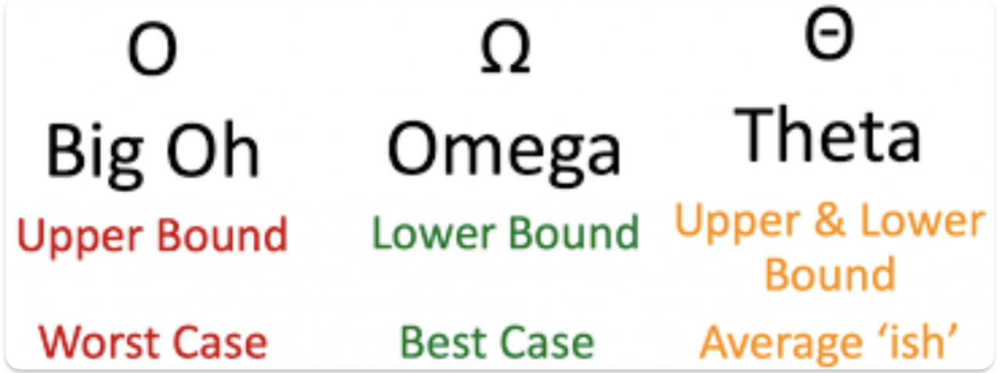

<table>
  <tr>
    <td width="50%" valign="top"></td>
    <td width="50%" valign="bottom"></td>
  </tr>
</table>

## 1. Circle/mark all the statements below that are true:

**a.** `log(n) = O(n)`

**b.** `n = O(log(n))`

**c.** `log²(n) = O(n)`

**d.** `n = O(log²(n))`

**e.** `log(n) = Ω(n)`

**f.** `n = Ω(log(n))`

**g.** `5n³ + 7n + 13 = O(n⁵)`

**h.** `5n³ + 7n + 13 = Ω(n⁵)`

**i.** `5n³ + 7n + 13 = Ω(n)`

**j.** `log(n!) = Θ(nlog(n))`

**k.** `n^(1/2) = O(log(n))`

**l.** `2ⁿ = Ω(n!)`

## 2. Answer the following

**a.** What is the worst-case big-oh run time of Merge sort on n items?

 

**b.** What is the worst-case big-oh run time of Selection sort on n items?

 
